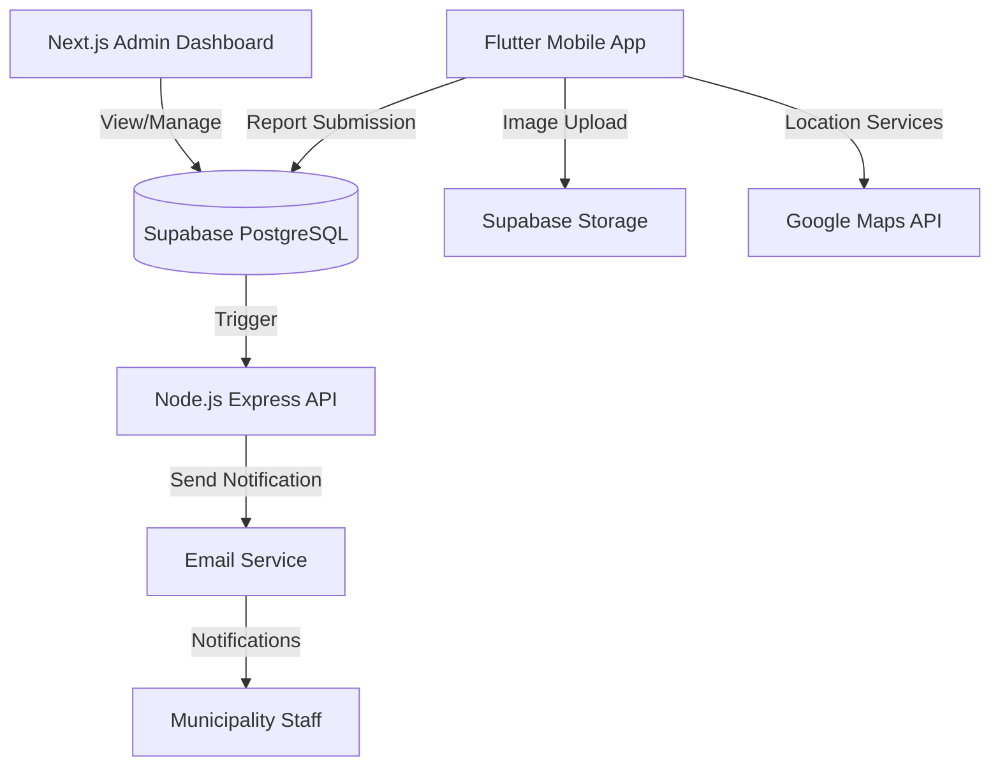
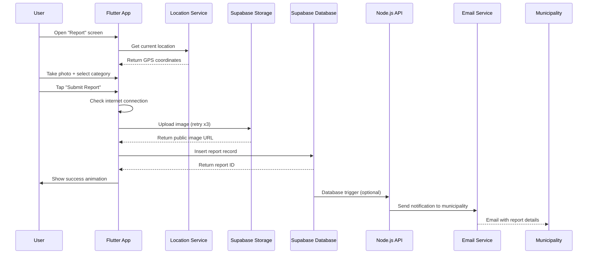

# FixMo Developer Guide 🇲🇺

> **FixMo** is an AI-powered civic reporting app that enables citizens of Mauritius to report street-level problems (potholes, broken lights, garbage, drainage, etc.) directly to their local municipalities using GPS location, photos, and smart categorization.

---

## 📐 App Architecture Overview

FixMo follows a modern full-stack architecture with clear separation of concerns:



### Core Components

| Layer | Technology | Purpose |
|-------|------------|---------|
| **Mobile App** | Flutter (Dart) | Cross-platform UI for iOS & Android |
| **Backend API** | Node.js + Express | Report processing & email notifications |
| **Database** | Supabase (PostgreSQL) | Data persistence with RLS policies |
| **Storage** | Supabase Storage | Image hosting (5MB limit per image) |
| **Admin Dashboard** | Next.js (React + TypeScript) | Municipality portal for report management |
| **Maps** | Google Maps SDK + Geocoding API | Location services & reverse geocoding |
| **Authentication** | Supabase Auth (Optional) | Currently supports anonymous reporting |

---

## 🗂️ Project Structure

```
MAU Municipality/
│
├── frontend/fixmo_app/          # Flutter mobile app
│   ├── lib/
│   │   ├── config/
│   │   │   └── app_config.dart         # API keys, URLs, constants
│   │   ├── models/
│   │   │   └── report_model.dart       # Data models
│   │   ├── providers/
│   │   │   ├── app_state_provider.dart # Global state management
│   │   │   └── theme_provider.dart     # Theme configuration
│   │   ├── screens/
│   │   │   ├── splash_screen.dart      # App launch screen
│   │   │   ├── home_screen.dart        # Main dashboard with map
│   │   │   ├── report_screen.dart      # Report creation flow
│   │   │   ├── history_screen.dart     # User's past reports
│   │   │   └── settings_screen.dart    # App settings
│   │   ├── services/
│   │   │   ├── supabase_service.dart   # Database & storage operations
│   │   │   ├── location_service.dart   # GPS & geolocation
│   │   │   ├── reports_service.dart    # Report management
│   │   │   └── map_marker_service.dart # Map customization
│   │   ├── widgets/
│   │   │   ├── upload_progress_overlay.dart  # Upload animations
│   │   │   ├── platform_image.dart     # Cross-platform image widget
│   │   │   └── municipality_selector.dart
│   │   └── main.dart                   # App entry point
│   ├── android/                        # Android-specific config
│   ├── ios/                            # iOS-specific config
│   ├── assets/                         # Images, icons, data files
│   └── pubspec.yaml                    # Flutter dependencies
│
├── backend/                     # Node.js API server
│   ├── server.js               # Express server with email logic
│   ├── package.json            # Node dependencies
│   └── .env                    # Environment variables
│
├── admin-dashboard/            # Next.js admin portal
│   ├── src/app/
│   │   ├── page.tsx           # Dashboard homepage
│   │   └── layout.tsx         # Root layout
│   ├── src/lib/
│   │   └── supabase.ts        # Supabase client config
│   └── package.json
│
└── Database Setup Files
    ├── complete_database_setup.sql      # Full DB schema + policies
    ├── supabase_schema.sql
    └── DATABASE_SETUP_INSTRUCTIONS.md
```

---

## 🔄 Data Flow: Report Submission



---

## 🔑 Key Components Explained

### 1. Authentication
- **Current**: Anonymous reporting (no login required)
- **Future**: Optional Supabase Auth with email/password or OTP
- **User ID**: Currently uses device-generated anonymous ID

### 2. Location Services
- **GPS Tracking**: Uses `geolocator` package for real-time location
- **Reverse Geocoding**: Google Geocoding API converts lat/lng to address
- **Municipality Detection**: Matches GPS coordinates to nearest municipality from database

### 3. Image Upload
- **Storage**: Supabase Storage bucket `reportimages`
- **Compression**: Images compressed to 80% quality before upload
- **File Size Limit**: 5MB per image
- **Retry Logic**: 3 attempts with exponential backoff (2s, 4s, 8s)
- **Web Support**: Uploads `Uint8List` for web platform compatibility

### 4. Report Management
- **Status Workflow**: `pending` → `in_progress` → `resolved`
- **Priority Levels**: 1 (Low), 2 (Medium), 3 (High)
- **Categories**: 6 main categories with 60+ specific issue types
- **Real-time Sync**: Supabase provides live updates to admin dashboard

### 5. Offline Handling
- Reports saved locally if no internet (future feature)
- Auto-retry on connection restore
- User-friendly error messages with retry options

---

## 🗄️ Database Schema

### Tables

**`reports`**
| Column | Type | Description |
|--------|------|-------------|
| `id` | UUID | Primary key (auto-generated) |
| `user_id` | UUID | User identifier (nullable for anonymous) |
| `title` | VARCHAR(255) | Report title |
| `description` | TEXT | Detailed description |
| `category` | VARCHAR(100) | Main category (e.g., "Roads & Transport") |
| `municipality` | VARCHAR(100) | Target municipality |
| `latitude` | DOUBLE PRECISION | GPS latitude |
| `longitude` | DOUBLE PRECISION | GPS longitude |
| `address` | TEXT | Readable address |
| `image_url` | TEXT | Supabase storage URL |
| `status` | VARCHAR(50) | pending / in_progress / resolved |
| `created_at` | TIMESTAMP | Report creation time |
| `updated_at` | TIMESTAMP | Last modification time |

**`municipalities`**
| Column | Type | Description |
|--------|------|-------------|
| `id` | VARCHAR(50) | Primary key (e.g., "port-louis") |
| `name` | VARCHAR(100) | English name |
| `name_fr` | VARCHAR(100) | French name |
| `name_kreol` | VARCHAR(100) | Mauritian Creole name |
| `coordinates` | JSONB | `{latitude, longitude}` |
| `email` | VARCHAR(255) | Contact email |
| `phone` | VARCHAR(50) | Contact phone |

### Storage Buckets

**`reportimages`**
- Public bucket (read access for all)
- Insert requires authentication (anonymous allowed)
- 5MB file size limit
- Allowed types: JPEG, PNG, WebP, GIF

### Row Level Security (RLS) Policies

```sql
-- Anyone can read reports
CREATE POLICY "Enable read access for all users" 
ON public.reports FOR SELECT USING (true);

-- Anyone can insert reports (anonymous reporting)
CREATE POLICY "Enable insert for all users" 
ON public.reports FOR INSERT WITH CHECK (true);

-- Only authenticated users can update reports
CREATE POLICY "Enable update for authenticated users" 
ON public.reports FOR UPDATE USING (true);
```

---

## 🌍 API Endpoints

### Supabase Endpoints (Auto-generated REST API)

**Reports**
- `GET /rest/v1/reports` - Fetch all reports
- `GET /rest/v1/reports?municipality=eq.Port%20Louis` - Filter by municipality
- `POST /rest/v1/reports` - Create new report
- `PATCH /rest/v1/reports?id=eq.<id>` - Update report status

**Storage**
- `POST /storage/v1/object/reportimages/<path>` - Upload image
- `GET /storage/v1/object/public/reportimages/<path>` - Fetch image

### Node.js Backend Endpoints

**Health Check**
```
GET /health
Response: { status: "ok", message: "FixMo Backend API is running" }
```

**Create Report (with email notification)**
```
POST /create-report
Body: {
  title: string,
  description: string,
  category: string,
  municipality: string,
  latitude: number,
  longitude: number,
  address: string,
  image_url?: string
}
```

**Notify Municipality**
```
POST /notify-municipality
Body: { reportId: string }
```

---

## 🔧 Environment Variables

### Flutter App (`lib/config/app_config.dart`)
```dart
static const String supabaseUrl = 'https://YOUR-PROJECT.supabase.co';
static const String supabaseAnonKey = 'YOUR_ANON_KEY';
static const String googleMapsApiKey = 'YOUR_GOOGLE_MAPS_API_KEY';
```

### Node.js Backend (`.env`)
```bash
PORT=3001
EMAIL_USER=fixmo.mauritius@gmail.com
EMAIL_PASS=your_app_password
SUPABASE_URL=https://YOUR-PROJECT.supabase.co
SUPABASE_SERVICE_ROLE_KEY=YOUR_SERVICE_ROLE_KEY
```

### Next.js Admin Dashboard (`.env.local`)
```bash
NEXT_PUBLIC_SUPABASE_URL=https://YOUR-PROJECT.supabase.co
NEXT_PUBLIC_SUPABASE_ANON_KEY=YOUR_ANON_KEY
```

### How to Get API Keys

**Supabase**
1. Create account at [supabase.com](https://supabase.com)
2. Create new project
3. Go to Settings → API → Copy `URL` and `anon` key

**Google Maps**
1. Go to [Google Cloud Console](https://console.cloud.google.com)
2. Enable Maps SDK for Android, Maps SDK for iOS, Geocoding API
3. Create API key with restrictions (Android + iOS + Geocoding)

---

## 💻 Local Development Setup

### Prerequisites
- Flutter SDK 3.8.1+
- Node.js 18+
- Android Studio / Xcode
- Supabase account
- Google Cloud account

### Step 1: Clone & Install Dependencies

```bash
# Clone the repository
cd "MAU Municipality"

# Install Flutter dependencies
cd frontend/fixmo_app
flutter pub get

# Install backend dependencies
cd ../../backend
npm install

# Install admin dashboard dependencies
cd ../admin-dashboard
npm install
```

### Step 2: Configure Environment

1. Update `frontend/fixmo_app/lib/config/app_config.dart` with your API keys
2. Update `backend/.env` with your credentials
3. Update `admin-dashboard/.env.local` with Supabase credentials

### Step 3: Setup Database

1. Go to Supabase Dashboard → SQL Editor
2. Run `complete_database_setup.sql` to create tables and policies
3. Verify by checking Table Editor

### Step 4: Run Development Servers

**Terminal 1: Flutter App**
```bash
cd frontend/fixmo_app
flutter run -d chrome  # For web testing
flutter run -d <device-id>  # For Android/iOS
```

**Terminal 2: Node.js Backend**
```bash
cd backend
node server.js
# Server runs on http://localhost:3001
```

**Terminal 3: Admin Dashboard**
```bash
cd admin-dashboard
npm run dev
# Dashboard runs on http://localhost:3000
```

---

## 📦 Building & Deployment

### Build Android APK (Release)

```bash
cd frontend/fixmo_app

# Clean previous builds
flutter clean
flutter pub get

# Build release APK
flutter build apk --release --target-platform android-arm64

# APK location: build/app/outputs/flutter-apk/app-release.apk
```

### Build iOS App (Release)

```bash
cd frontend/fixmo_app

# Ensure iOS dependencies are installed
cd ios
pod install
cd ..

# Build iOS release
flutter build ios --release

# Open Xcode for signing and distribution
open ios/Runner.xcworkspace
```

### Deploy Backend to Railway/Render

1. Push code to GitHub
2. Connect Railway/Render to repository
3. Set environment variables in dashboard
4. Deploy automatically on push

### Deploy Admin Dashboard to Vercel

```bash
cd admin-dashboard
vercel --prod
```

---

## 🎨 App Icon Design Concept

### Suggested Design for FixMo Icon

**Visual Concept:**
- **Shape**: Rounded square (1024x1024px with safe area)
- **Background**: Gradient using Mauritius flag colors
  - Top-left: Red (#EA2839)
  - Top-right: Blue (#1A1A6D)
  - Bottom-left: Yellow (#FFD500)
  - Bottom-right: Green (#00843D)
- **Central Icon**: Wrench + Location Pin hybrid symbol
  - Wrench represents "fixing" and civic maintenance
  - Location pin represents GPS-based reporting
  - Color: Accent purple (#6C63FF) with white outline for contrast
- **Style**: Modern, flat design with subtle drop shadow
- **Typography**: "FixMo" wordmark below icon (optional for splash screen)

**Design Tools:**
- **Figma**: [figma.com](https://figma.com) (recommended - free tier available)
- **Canva**: [canva.com](https://canva.com) (easy templates)
- **Adobe Illustrator**: Professional vector design

**Export Specifications:**
- **Android**: 
  - `res/mipmap-xxxhdpi/ic_launcher.png` (192x192px)
  - `res/mipmap-xxhdpi/ic_launcher.png` (144x144px)
  - `res/mipmap-xhdpi/ic_launcher.png` (96x96px)
- **iOS**:
  - `Assets.xcassets/AppIcon.appiconset/` (Multiple sizes)
  - Use [appicon.co](https://appicon.co) to generate all sizes

**Inspiration:**
The icon should convey:
1. **Civic duty** - Citizens helping their community
2. **Technology** - Modern, app-based solution
3. **Mauritian identity** - National colors and pride
4. **Actionability** - The wrench symbolizes immediate action

---

## 🧪 Testing Strategy

### Unit Tests
```bash
cd frontend/fixmo_app
flutter test
```

### Integration Tests
```bash
flutter drive --target=test_driver/app.dart
```

### Manual Testing Checklist
- [ ] Report submission with image (WiFi)
- [ ] Report submission without image
- [ ] Report submission on mobile data
- [ ] Upload retry on connection failure
- [ ] Location accuracy within 50m
- [ ] Municipality auto-detection
- [ ] Report history displays correctly
- [ ] Admin dashboard shows new reports
- [ ] Email notifications sent to municipalities

---

## 🐛 Troubleshooting

### Issue: "Upload failed multiple times check connection"

**Cause**: Network timeout or Supabase storage policy issue

**Solution**:
1. Check internet connection
2. Verify Supabase storage bucket `reportimages` exists
3. Ensure RLS policies allow anonymous INSERT on `storage.objects`
4. Check `AppConfig.uploadTimeout` is reasonable (30s default)

### Issue: Google Maps not showing

**Cause**: Invalid or restricted API key

**Solution**:
1. Verify API key in `app_config.dart`
2. Enable required APIs in Google Cloud Console:
   - Maps SDK for Android
   - Maps SDK for iOS
   - Geocoding API
3. Check API key restrictions (allow your app's package name)

### Issue: "Failed to create report"

**Cause**: Database connection or RLS policy blocking insert

**Solution**:
1. Run `complete_database_setup.sql` in Supabase SQL Editor
2. Verify `reports` table exists
3. Check RLS policies allow INSERT for anonymous users
4. Inspect browser console / Flutter logs for detailed error

### Issue: App crashes on camera open

**Cause**: Missing permissions in AndroidManifest.xml / Info.plist

**Solution**:
Add permissions:

**Android** (`android/app/src/main/AndroidManifest.xml`):
```xml
<uses-permission android:name="android.permission.CAMERA" />
<uses-permission android:name="android.permission.READ_EXTERNAL_STORAGE"/>
<uses-permission android:name="android.permission.WRITE_EXTERNAL_STORAGE"/>
```

**iOS** (`ios/Runner/Info.plist`):
```xml
<key>NSCameraUsageDescription</key>
<string>FixMo needs camera access to capture photos of civic issues.</string>
<key>NSPhotoLibraryUsageDescription</key>
<string>FixMo needs photo library access to select images.</string>
```

---

## 📚 Additional Resources

- **Flutter Documentation**: https://docs.flutter.dev
- **Supabase Documentation**: https://supabase.com/docs
- **Google Maps Flutter Plugin**: https://pub.dev/packages/google_maps_flutter
- **Material Design Guidelines**: https://m3.material.io
- **Mauritius Open Data**: http://data.govmu.org

---

## 🤝 Contributing

When contributing to FixMo:

1. **Follow the existing code structure** - Keep files organized by feature
2. **Use meaningful commit messages** - Prefix with feat/fix/docs/refactor
3. **Test thoroughly** - Ensure uploads work on both WiFi and mobile data
4. **Update documentation** - Add new features to this guide
5. **Maintain consistency** - Use accent color (#6C63FF) for all CTAs

---

## 📄 License & Contact

**Project**: FixMo - Civic Reporting for Mauritius  
**Version**: 1.0.1  
**Last Updated**: January 2026  

For questions or partnership inquiries:  
📧 fixmo@projectmu.org  
🇲🇺 Built with ❤️ for Mauritius

---

**Happy Coding! 🚀**
